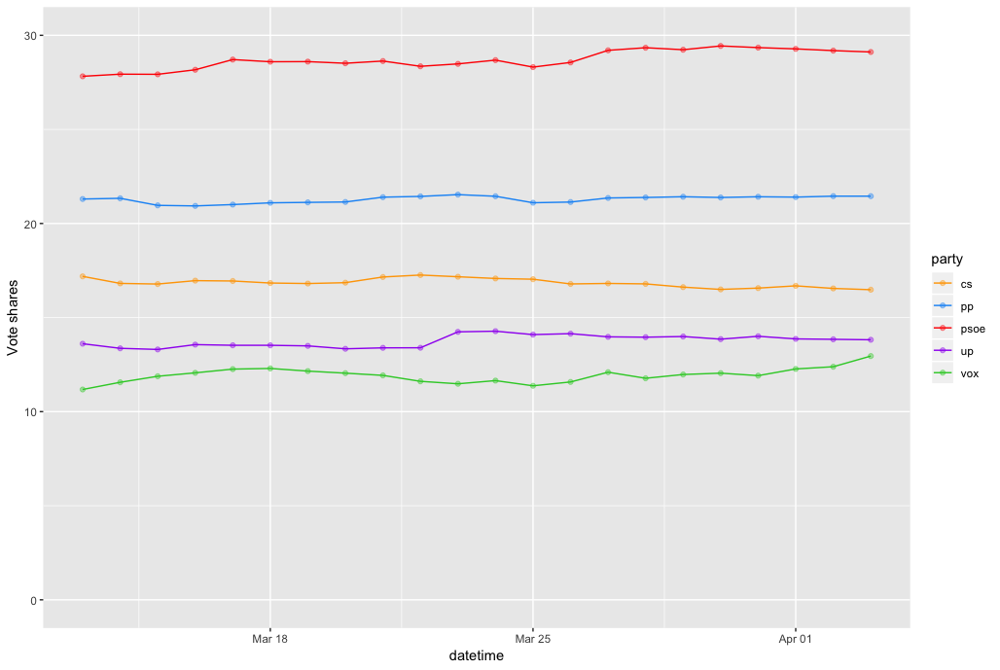

Estos los resultados electorales más probables para los 5 grandes partidos [Actualizado: 3 de abril de 2019]

```{r graph1, echo=FALSE, out.width = '100%'}

```


_________________

```{r pressure, echo=FALSE, out.width = '20%'}
knitr::include_graphics("uzh.png")
```

Contact: Alberto López Ortega _alberto.lopezortega@uzh.ch_ , [bertous](https://twitter.com/bertous)


